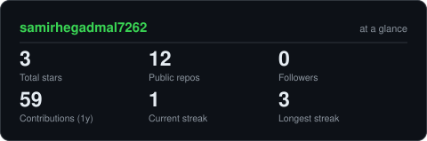
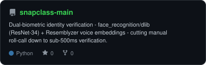
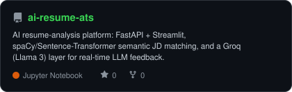
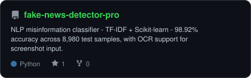
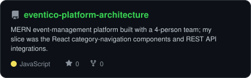

<div align="center">

<!-- PORTRAIT - Generated by dotify.py using me.jpeg -->
<picture>
  <source media="(prefers-color-scheme: dark)"  srcset="assets/portrait-dark.svg">
  <source media="(prefers-color-scheme: light)" srcset="assets/portrait-light.svg">
  
</picture>

<br>

<!-- NAME / TAGLINE - animated typing -->
<a href="https://github.com/samirhegadmal7262">
  
</a>

<br>

<!-- SOCIALS -->
<a href="https://www.linkedin.com/in/samir-hegadmal"></a>
<a href="mailto:samirhegadmal7262@gmail.com"></a>
<a href="https://github.com/samirhegadmal7262"></a>


</div>

---

## `~/` whoami

```console
$ cat about.txt
```

Hi, I'm **Samir Hegadmal**. I'm an AI/ML engineer out of Nashik, India, building at the
intersection of computer vision, NLP, and LLM integration — with hands-on Python backend
work (FastAPI, Flask) tying it all together.

- Currently building **[SnapClass](https://github.com/samirhegadmal7262/snapclass-main)**, a dual-biometric identity verification pipeline (face + voice)
- Deepening **RAG, LangChain, and vector databases (FAISS, Pinecone)** — moving from ML fundamentals into production GenAI
- 4 internships across AI/NLP, Python, and full-stack development
- Fun fact: **I ranked #16 of all interns in my NLP internship cohort for technical delivery**

<br>

<div align="center">

## `~/` toolbox


</div>

---

<div align="center">

## `~/` skill radar

<table>
<tr>
<td width="50%" align="center" valign="middle">

<!-- Self-rated radar - edit assets/skills.json, the workflow redraws it -->
<picture>
  <source media="(prefers-color-scheme: dark)"  srcset="assets/radar-dark.svg">
  <source media="(prefers-color-scheme: light)" srcset="assets/radar-light.svg">
  
</picture>

</td>
<td width="50%" align="center" valign="middle">

<!-- Live radar built from real language byte counts across your repos -->
<picture>
  <source media="(prefers-color-scheme: dark)"  srcset="assets/radar-langs-dark.svg">
  <source media="(prefers-color-scheme: light)" srcset="assets/radar-langs-light.svg">
  
</picture>

</td>
</tr>
</table>

</div>

---

<div align="center">

## `~/` contribution calendar

<!-- 3D isometric calendar, regenerated every 6h by .github/workflows/metrics.yml -->


<br><br>

<!-- Snake eats the contribution graph - .github/workflows/snake.yml -->
<picture>
  <source media="(prefers-color-scheme: dark)"  srcset="https://raw.githubusercontent.com/samirhegadmal7262/samirhegadmal7262/output/snake-dark.svg">
  <source media="(prefers-color-scheme: light)" srcset="https://raw.githubusercontent.com/samirhegadmal7262/samirhegadmal7262/output/snake.svg">
  
</picture>

</div>

---

<div align="center">

## `~/` the numbers

<!-- Generated by scripts/cards.py into this repo. Deliberately NOT
     github-readme-stats / streak-stats / github-profile-trophy: those are
     shared public instances that go down and take the whole section with them. -->
<picture>
  <source media="(prefers-color-scheme: dark)"  srcset="assets/card-stats-dark.svg">
  <source media="(prefers-color-scheme: light)" srcset="assets/card-stats-light.svg">
  
</picture>

<br>


<br><br>


</div>

---

<div align="center">

## `~/` selected work

<!-- Cards generated by scripts/cards.py from assets/projects.json.
     Stars, forks and language are pulled live from the API on every run. -->
<table>
<tr>
<td width="50%">
  <a href="https://github.com/samirhegadmal7262/snapclass-main">
    <picture>
      <source media="(prefers-color-scheme: dark)"  srcset="assets/card-snapclass-main-dark.svg">
      <source media="(prefers-color-scheme: light)" srcset="assets/card-snapclass-main-light.svg">
      
    </picture>
  </a>
</td>
<td width="50%">
  <a href="https://github.com/samirhegadmal7262/ai-resume-ats">
    <picture>
      <source media="(prefers-color-scheme: dark)"  srcset="assets/card-ai-resume-ats-dark.svg">
      <source media="(prefers-color-scheme: light)" srcset="assets/card-ai-resume-ats-light.svg">
      
    </picture>
  </a>
</td>
</tr>
<tr>
<td width="50%">
  <a href="https://github.com/samirhegadmal7262/fake-news-detector-pro">
    <picture>
      <source media="(prefers-color-scheme: dark)"  srcset="assets/card-fake-news-detector-pro-dark.svg">
      <source media="(prefers-color-scheme: light)" srcset="assets/card-fake-news-detector-pro-light.svg">
      
    </picture>
  </a>
</td>
<td width="50%">
  <a href="https://github.com/samirhegadmal7262/eventico-platform-architecture">
    <picture>
      <source media="(prefers-color-scheme: dark)"  srcset="assets/card-eventico-platform-architecture-dark.svg">
      <source media="(prefers-color-scheme: light)" srcset="assets/card-eventico-platform-architecture-light.svg">
      
    </picture>
  </a>
</td>
</tr>
</table>

<sub>

| project | live | stack |
|---|---|---|
| **[SnapClass](https://github.com/samirhegadmal7262/snapclass-main)** | [snapclass-frontend-ten.vercel.app](https://snapclass-frontend-ten.vercel.app) | `Python` `face_recognition` `dlib` `Resemblyzer` `Flask` `Supabase` |
| **[AI Resume ATS](https://github.com/samirhegadmal7262/ai-resume-ats)** | [ai-resume-intellect.streamlit.app](https://ai-resume-intellect.streamlit.app) | `FastAPI` `Streamlit` `spaCy` `Sentence-Transformers` `Groq (Llama 3)` |
| **[Fake News Detector Pro](https://github.com/samirhegadmal7262/fake-news-detector-pro)** | — | `Python` `Scikit-learn` `TF-IDF` `OCR` |
| **[EVENTICO](https://github.com/samirhegadmal7262/eventico-platform-architecture)** | [eventico-intelligence.vercel.app](https://eventico-intelligence.vercel.app) | `React.js` `Node.js` `Express.js` `MongoDB Atlas` |

</sub>

</div>

---

<div align="center">

<sub>`01110011 01101000 01101001 01110000 00100000 01101001 01110100`</sub>

</div>
